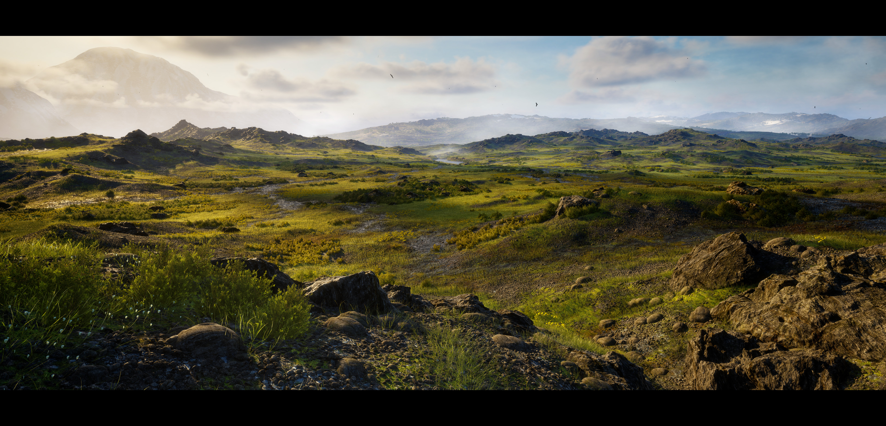
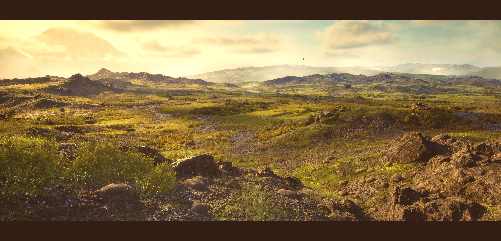

# Baby Photoshop

A command-line image editor written in C++ that applies 15 filters to images using raw pixel manipulation — no external image-processing libraries.

## Samples

| Original | Filtered |
|----------|----------|
|  |  |
|  |  |

## Features

- Grayscale, Black & White, Invert
- Flip (horizontal / vertical)
- Rotate (90°, 180°, 270°)
- Darken, Lighten
- Blur, Edge Detection
- Crop, Resize
- Merge two images
- Add frame, Warm Tone, Purple Tint, Scan Lines

## Project Structure
```
baby-photoshop/
├── src/
│   ├── main.cpp
│   ├── filters.h
│   └── filters/
│       ├── Grayscale.cpp
│       ├── BlackWhite.cpp
│       ├── Invert.cpp
│       ├── Merge.cpp
│       ├── Flip.cpp
│       ├── Rotate.cpp
│       ├── DarkenLighten.cpp
│       ├── Crop.cpp
│       ├── Frame.cpp
│       ├── Edges.cpp
│       ├── Resize.cpp
│       ├── Blur.cpp
│       ├── WarmTone.cpp
│       ├── PurpleTint.cpp
│       └── ScanLines.cpp
├── lib/
│   ├── Image_Class.h
│   ├── stb_image.h
│   └── stb_image_write.h
└── samples/
```

## Build & Run
```bash
g++ src/main.cpp src/filters/*.cpp -I lib/ -o photoshop
./photoshop
```

## Usage

Run the program, load an image by filename, select a filter from the menu, then save the result.

## Contributors 

- [Abdelrhman Moubarak](https://github.com/Abdelrhman-Moubarak)
- [Nariman Sayed](https://github.com/Nariman-Sayed)
